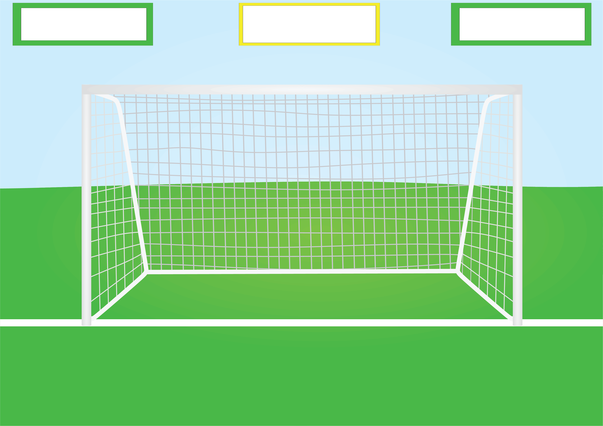

// Start with an initial value of 30 seconds
//const TIME_LIMIT = 30;

// Initially, no time has passed, but this will count up
// and subtract from the TIME_LIMIT
let timePassed = 0;
let timeLeft = TIME_LIMIT;

document.getElementById("app").innerHTML = `

  <svg class="base-timer__svg" viewBox="0 0 100 100" xmlns="http://www.w3.org/2000/svg">
    <g class="base-timer__circle">
      <circle class="base-timer__path-elapsed" cx="50" cy="50" r="45"></circle>
    </g>
  </svg>
  
    ${formatTime(timeLeft)}
  

`;

function formatTimeLeft(time) {
    // The largest round integer less than or equal to the result of time divided being by 60.
    const minutes = Math.floor(time / 60);
    
    // Seconds are the remainder of the time divided by 60 (modulus operator)
    let seconds = time % 60;
    
    // If the value of seconds is less than 10, then display seconds with a leading zero
    if (seconds < 10) {
      seconds = `0${seconds}`;
    }
  
    // The output in MM:SS format
    return `${minutes}:${seconds}`;
}

var time_limit = 30;

var time_out = setInterval(() => {

  if(time_limit == 0) {
    
    clearTimeout(timer_out);
    elem.innerHTML = "TIME'S UP";;
        
  } else {
    
    if(time_limit < 10) {
      time_limit = 0 + '' + time_limit;
    }
    
    $('#timer').html('00:' + time_limit);
    
    time_limit -= 1;
    
  }

}, 1000);

#level {
    background-color: white;
    width: 100px;
    border: 15px solid black;
    padding: 5px;
    position: relative;
    margin-top: 50px;
    left: 600px;
    text-align: center;
    float:left; 
}

  
  

  

<body>
  

    

      

        

          
        

      

    

  

  
</body>

Start of old CSS

.goal {
    border: 10px solid #4D68ED;
}

.center {
    position: relative;
    display: block;
    margin-top: relative;
    margin-left: auto;
    margin-right: auto;
    width: 50%;
}
#container {
    width: 100px;
    height: 100px;
    position: relative;
}

#timer {
    display: inline-block;
    position: relative;
    background-color: white;
    width: 100px;
    border: 15px solid #EDC94D;
    padding: 5px;
    left: 360px;
    margin: 20px;
    margin-top: 50px;
    margin-left: auto;
    margin-right: auto;
    text-align: center;
}

@font-face {
    font-family: "LevelDesign";
    src: local("LevelDesign"),
      url("SedgwickAveDisplay-Regular.ttf") format("truetype");
  }

#level {
    display: inline-block;
    position: relative;
    background-color: white;
    width: 100px;
    border: 5px solid #EDC94D;
    padding: 10px;
    left: 520px;
    margin: 20px;
    margin-top: 50px;
    margin-left: auto;
    margin-right: auto;
    text-align: center;
    font-family: "LevelDesign", monospace;
}

#score {
    display: inline-block;
    position: relative;
    background-color: white;
    width: 100px;
    border: 15px solid #EDC94D;
    padding: 5px;
    left: 670px;
    margin: 20px;
    margin-top: 50px;
    margin-left: auto;
    margin-right: auto;
    text-align: center;
}

  